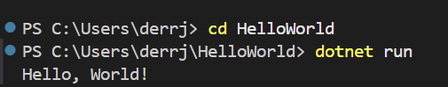
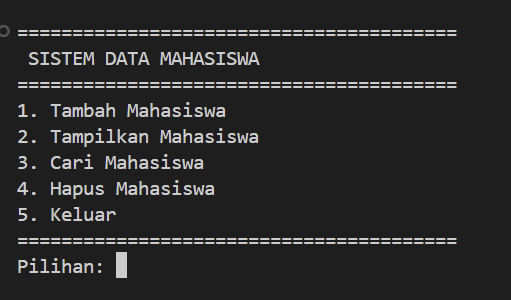
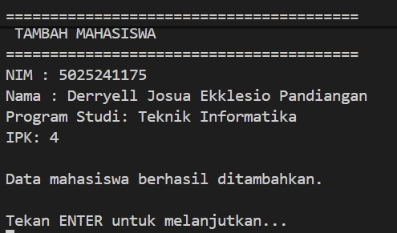
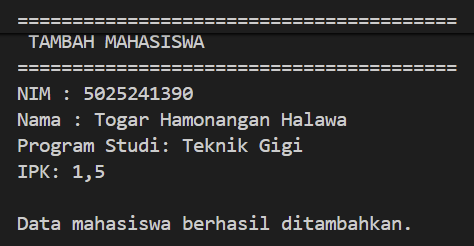
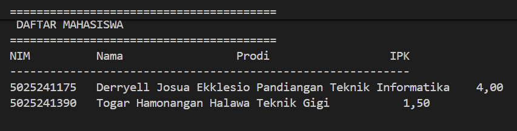
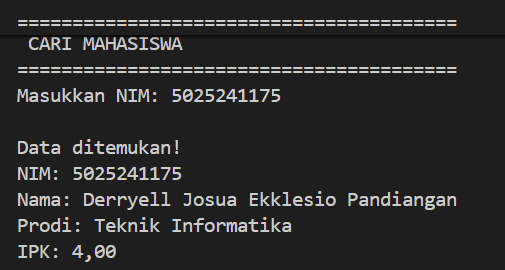
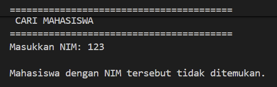
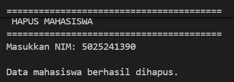
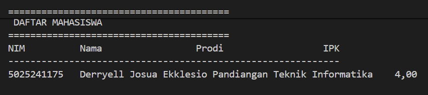
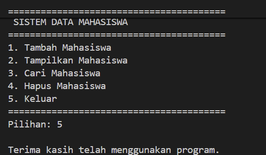

# Tugas Pemrograman Berbasis Kerangka Kerja (PBKK) W2
## HelloWorld!
### Langkah Pengerjaan
Jalankan code berikut secara berurutan pada terminal
```
dotnet new console -n HelloWorld
cd HelloWorld
dotnet run 
```
### Dokumentasi Hasil Run


## Sistem Data Mahasiswa
### Langkah Pengerjaan
Jalankan code berikut secara berurutan pada terminal
```
dotnet new console -n DataMahasiswa
cd DataMahasiswa
code .
```
Buka File ```Program.cs``` dan isi dengan code berikut
```
using System;
using System.Collections.Generic;

namespace DataMahasiswa
{
    // Class untuk merepresentasikan data mahasiswa
    class Mahasiswa
    {
        public string NIM { get; set; }
        public string Nama { get; set; }
        public string Prodi { get; set; }
        public double IPK { get; set; }

        // Constructor
        public Mahasiswa(string nim, string nama, string prodi, double ipk)
        {
            NIM = nim;
            Nama = nama;
            Prodi = prodi;
            IPK = ipk;
        }
    }

    class Program
    {
        // List untuk menyimpan data mahasiswa
        static List<Mahasiswa> daftarMahasiswa = new List<Mahasiswa>();

        static void Main(string[] args)
        {
            int pilihan;
            do
            {
                TampilkanMenu();
                Console.Write("Pilihan: ");
                
                string input = Console.ReadLine() ?? string.Empty;
                
                if (!int.TryParse(input, out pilihan))
                {
                    pilihan = 0;
                }
                
                Console.WriteLine();
                
                switch (pilihan)
                {
                    case 1:
                        TambahMahasiswa();
                        break;
                    case 2:
                        TampilkanMahasiswa();
                        break;
                    case 3:
                        CariMahasiswa();
                        break;
                    case 4:
                        HapusMahasiswa();
                        break;
                    case 5:
                        Console.WriteLine("Terima kasih telah menggunakan program.");
                        break;
                    default:
                        Console.WriteLine("Pilihan tidak tersedia!");
                        break;
                }
                
                if (pilihan != 5)
                {
                    Console.WriteLine();
                    Console.WriteLine("Tekan ENTER untuk melanjutkan...");
                    Console.ReadLine();
                }
            } while (pilihan != 5);
        }

        // =========================
        // METHOD MENAMPILKAN MENU
        // =========================
        static void TampilkanMenu()
        {
            Console.Clear();
            Console.WriteLine("========================================");
            Console.WriteLine(" SISTEM DATA MAHASISWA");
            Console.WriteLine("========================================");
            Console.WriteLine("1. Tambah Mahasiswa");
            Console.WriteLine("2. Tampilkan Mahasiswa");
            Console.WriteLine("3. Cari Mahasiswa");
            Console.WriteLine("4. Hapus Mahasiswa");
            Console.WriteLine("5. Keluar");
            Console.WriteLine("========================================");
        }

        // =========================
        // METHOD TAMBAH MAHASISWA
        // =========================
        static void TambahMahasiswa()
        {
            Console.Clear();
            Console.WriteLine("========================================");
            Console.WriteLine(" TAMBAH MAHASISWA");
            Console.WriteLine("========================================");
            
            Console.Write("NIM : ");
            string nim = Console.ReadLine() ?? string.Empty;
            
            Console.Write("Nama : ");
            string nama = Console.ReadLine() ?? string.Empty;
            
            Console.Write("Program Studi: ");
            string prodi = Console.ReadLine() ?? string.Empty;
            
            double ipk;
            while (true)
            {
                Console.Write("IPK: ");
                if (double.TryParse(Console.ReadLine(), out ipk))
                {
                    if (ipk >= 0 && ipk <= 4)
                    {
                        break;
                    }
                }
                Console.WriteLine("IPK harus berupa angka 0-4.");
            }
            
            Mahasiswa mahasiswa = new Mahasiswa(nim, nama, prodi, ipk);
            daftarMahasiswa.Add(mahasiswa);
            
            Console.WriteLine();
            Console.WriteLine("Data mahasiswa berhasil ditambahkan.");
        }

        // =========================
        // METHOD MENAMPILKAN DATA
        // =========================
        static void TampilkanMahasiswa()
        {
            Console.Clear();
            Console.WriteLine("========================================");
            Console.WriteLine(" DAFTAR MAHASISWA");
            Console.WriteLine("========================================");
            
            if (daftarMahasiswa.Count == 0)
            {
                Console.WriteLine("Belum ada data mahasiswa.");
                return;
            }
            
            Console.WriteLine("{0,-12} {1,-20} {2,-20} {3,5}", "NIM", "Nama", "Prodi", "IPK");
            Console.WriteLine("------------------------------------------------------------");
            
            foreach (Mahasiswa m in daftarMahasiswa)
            {
                Console.WriteLine("{0,-12} {1,-20} {2,-20} {3,5:F2}", m.NIM, m.Nama, m.Prodi, m.IPK);
            }
            Console.WriteLine();
        }

        // =========================
        // METHOD MENCARI MAHASISWA
        // =========================
        static void CariMahasiswa()
        {
            Console.Clear();
            Console.WriteLine("========================================");
            Console.WriteLine(" CARI MAHASISWA");
            Console.WriteLine("========================================");
            
            Console.Write("Masukkan NIM: ");
            string nimCari = Console.ReadLine() ?? string.Empty;
            
            Mahasiswa? mahasiswaDitemukan = null;
            
            foreach (Mahasiswa m in daftarMahasiswa)
            {
                if (m.NIM.Equals(nimCari, StringComparison.OrdinalIgnoreCase))
                {
                    mahasiswaDitemukan = m;
                    break;
                }
            }
            
            Console.WriteLine();
            
            if (mahasiswaDitemukan != null)
            {
                Console.WriteLine("Data ditemukan!");
                Console.WriteLine("NIM: " + mahasiswaDitemukan.NIM);
                Console.WriteLine("Nama: " + mahasiswaDitemukan.Nama);
                Console.WriteLine("Prodi: " + mahasiswaDitemukan.Prodi);
                Console.WriteLine("IPK: " + mahasiswaDitemukan.IPK.ToString("F2"));
            }
            else
            {
                Console.WriteLine("Mahasiswa dengan NIM tersebut tidak ditemukan.");
            }
        }

        // =========================
        // METHOD MENGHAPUS MAHASISWA
        // =========================
        static void HapusMahasiswa()
        {
            Console.Clear();
            Console.WriteLine("========================================");
            Console.WriteLine(" HAPUS MAHASISWA");
            Console.WriteLine("========================================");
            
            Console.Write("Masukkan NIM: ");
            string nimHapus = Console.ReadLine() ?? string.Empty;
            
            Mahasiswa? mahasiswaDitemukan = null;
            
            foreach (Mahasiswa m in daftarMahasiswa)
            {
                if (m.NIM.Equals(nimHapus, StringComparison.OrdinalIgnoreCase))
                {
                    mahasiswaDitemukan = m;
                    break;
                }
            }
            
            if (mahasiswaDitemukan != null)
            {
                daftarMahasiswa.Remove(mahasiswaDitemukan);
                Console.WriteLine();
                Console.WriteLine("Data mahasiswa berhasil dihapus.");
            }
            else
            {
                Console.WriteLine();
                Console.WriteLine("Data mahasiswa tidak ditemukan.");
            }
        }
    }
}
```
Save (ctrl + s) dan run dengan
```
dotnet run
```
### Dokumentasi Hasil Run

### Dokumentasi Tambah Data Mahasiswa 1

### Dokumentasi Tambah Data Mahasiswa 2

### Dokumentasi Tampilkan Data

### Dokumentasi Cari Data (berhasil)

### Dokumentasi Cari Data (gagal)

### Dokumentasi Hapus Data (berhasil)

### Dokumentasi Data Setelah Dihapus

### Dokumentasi Keluar


## Sistem Data Mahasiswa (UI)
Pada bagian ini, aplikasi **Sistem Data Mahasiswa** yang sebelumnya berbasis *Console Application* dikembangkan lebih lanjut dengan menambahkan antarmuka berbasis grafis (**GUI**) menggunakan **Windows Forms (WinForms)** di .NET framework.
### Langkah Pengerjaan
Jalankan code berikut satu-persatu pada terminal
```
dotnet new winforms -n DataMahasiswaUI
cd DataMahasiswaUI
code .
```
Kemudian buka file ```Form1.Designer.cs``` lalu isi dengan code berikut
```
namespace DataMahasiswaUI
{
    partial class Form1
    {
        private System.ComponentModel.IContainer components = null;
        private System.Windows.Forms.TextBox txtNIM;
        private System.Windows.Forms.TextBox txtNama;
        private System.Windows.Forms.TextBox txtProdi;
        private System.Windows.Forms.TextBox txtIPK;
        private System.Windows.Forms.TextBox txtCariNIM;
        private System.Windows.Forms.Button btnTambah;
        private System.Windows.Forms.Button btnCari;
        private System.Windows.Forms.Button btnHapus;
        private System.Windows.Forms.DataGridView dgvMahasiswa;
        private System.Windows.Forms.Label lblNIM;
        private System.Windows.Forms.Label lblNama;
        private System.Windows.Forms.Label lblProdi;
        private System.Windows.Forms.Label lblIPK;
        private System.Windows.Forms.Label lblCari;
        private System.Windows.Forms.Panel panelHeader;
        private System.Windows.Forms.Label lblTitle;

        protected override void Dispose(bool disposing)
        {
            if (disposing && (components != null))
            {
                components.Dispose();
            }
            base.Dispose(disposing);
        }

        private void InitializeComponent()
        {
            System.Windows.Forms.DataGridViewCellStyle dgvHeaderStyle = new System.Windows.Forms.DataGridViewCellStyle();
            System.Windows.Forms.DataGridViewCellStyle dgvCellStyle = new System.Windows.Forms.DataGridViewCellStyle();

            this.panelHeader = new System.Windows.Forms.Panel();
            this.lblTitle = new System.Windows.Forms.Label();
            this.lblNIM = new System.Windows.Forms.Label();
            this.lblNama = new System.Windows.Forms.Label();
            this.lblProdi = new System.Windows.Forms.Label();
            this.lblIPK = new System.Windows.Forms.Label();
            this.lblCari = new System.Windows.Forms.Label();
            this.txtNIM = new System.Windows.Forms.TextBox();
            this.txtNama = new System.Windows.Forms.TextBox();
            this.txtProdi = new System.Windows.Forms.TextBox();
            this.txtIPK = new System.Windows.Forms.TextBox();
            this.txtCariNIM = new System.Windows.Forms.TextBox();
            this.btnTambah = new System.Windows.Forms.Button();
            this.btnCari = new System.Windows.Forms.Button();
            this.btnHapus = new System.Windows.Forms.Button();
            this.dgvMahasiswa = new System.Windows.Forms.DataGridView();
            
            this.panelHeader.SuspendLayout();
            ((System.ComponentModel.ISupportInitialize)(this.dgvMahasiswa)).BeginInit();
            this.SuspendLayout();

            System.Drawing.Font fontLabel = new System.Drawing.Font("Segoe UI", 9.5F, System.Drawing.FontStyle.Bold);
            System.Drawing.Font fontInput = new System.Drawing.Font("Segoe UI", 9.5F);

            this.panelHeader.BackColor = System.Drawing.Color.FromArgb(((int)(((byte)(30)))), ((int)(((byte)(41)))), ((int)(((byte)(59)))));
            this.panelHeader.Controls.Add(this.lblTitle);
            this.panelHeader.Dock = System.Windows.Forms.DockStyle.Top;
            this.panelHeader.Location = new System.Drawing.Point(0, 0);
            this.panelHeader.Size = new System.Drawing.Size(620, 50);

            this.lblTitle.AutoSize = true;
            this.lblTitle.Font = new System.Drawing.Font("Segoe UI", 14F, System.Drawing.FontStyle.Bold);
            this.lblTitle.ForeColor = System.Drawing.Color.White;
            this.lblTitle.Location = new System.Drawing.Point(15, 12);
            this.lblTitle.Text = "Sistem Data Mahasiswa";

            this.lblNIM.Text = "NIM";
            this.lblNIM.Font = fontLabel;
            this.lblNIM.ForeColor = System.Drawing.Color.FromArgb(51, 65, 85);
            this.lblNIM.Location = new System.Drawing.Point(20, 70);
            this.lblNIM.Size = new System.Drawing.Size(80, 20);

            this.txtNIM.Font = fontInput;
            this.txtNIM.Location = new System.Drawing.Point(100, 68);
            this.txtNIM.Size = new System.Drawing.Size(160, 25);

            this.lblNama.Text = "Nama";
            this.lblNama.Font = fontLabel;
            this.lblNama.ForeColor = System.Drawing.Color.FromArgb(51, 65, 85);
            this.lblNama.Location = new System.Drawing.Point(20, 105);
            this.lblNama.Size = new System.Drawing.Size(80, 20);

            this.txtNama.Font = fontInput;
            this.txtNama.Location = new System.Drawing.Point(100, 103);
            this.txtNama.Size = new System.Drawing.Size(160, 25);

            this.lblProdi.Text = "Prodi";
            this.lblProdi.Font = fontLabel;
            this.lblProdi.ForeColor = System.Drawing.Color.FromArgb(51, 65, 85);
            this.lblProdi.Location = new System.Drawing.Point(20, 140);
            this.lblProdi.Size = new System.Drawing.Size(80, 20);

            this.txtProdi.Font = fontInput;
            this.txtProdi.Location = new System.Drawing.Point(100, 138);
            this.txtProdi.Size = new System.Drawing.Size(160, 25);

            this.lblIPK.Text = "IPK";
            this.lblIPK.Font = fontLabel;
            this.lblIPK.ForeColor = System.Drawing.Color.FromArgb(51, 65, 85);
            this.lblIPK.Location = new System.Drawing.Point(20, 175);
            this.lblIPK.Size = new System.Drawing.Size(80, 20);

            this.txtIPK.Font = fontInput;
            this.txtIPK.Location = new System.Drawing.Point(100, 173);
            this.txtIPK.Size = new System.Drawing.Size(160, 25);

            this.btnTambah.Text = "+ Tambah Data";
            this.btnTambah.Font = fontLabel;
            this.btnTambah.BackColor = System.Drawing.Color.FromArgb(16, 185, 129);
            this.btnTambah.ForeColor = System.Drawing.Color.White;
            this.btnTambah.FlatStyle = System.Windows.Forms.FlatStyle.Flat;
            this.btnTambah.FlatAppearance.BorderSize = 0;
            this.btnTambah.Location = new System.Drawing.Point(100, 210);
            this.btnTambah.Size = new System.Drawing.Size(160, 32);
            this.btnTambah.Click += new System.EventHandler(this.btnTambah_Click);

            this.lblCari.Text = "Cari/Hapus NIM:";
            this.lblCari.Font = fontLabel;
            this.lblCari.ForeColor = System.Drawing.Color.FromArgb(51, 65, 85);
            this.lblCari.Location = new System.Drawing.Point(310, 70);
            this.lblCari.Size = new System.Drawing.Size(130, 20);

            this.txtCariNIM.Font = fontInput;
            this.txtCariNIM.Location = new System.Drawing.Point(310, 95);
            this.txtCariNIM.Size = new System.Drawing.Size(280, 25);

            this.btnCari.Text = "Cari Data";
            this.btnCari.Font = fontLabel;
            this.btnCari.BackColor = System.Drawing.Color.FromArgb(37, 99, 235);
            this.btnCari.ForeColor = System.Drawing.Color.White;
            this.btnCari.FlatStyle = System.Windows.Forms.FlatStyle.Flat;
            this.btnCari.FlatAppearance.BorderSize = 0;
            this.btnCari.Location = new System.Drawing.Point(310, 130);
            this.btnCari.Size = new System.Drawing.Size(135, 32);
            this.btnCari.Click += new System.EventHandler(this.btnCari_Click);

            this.btnHapus.Text = "Hapus Data";
            this.btnHapus.Font = fontLabel;
            this.btnHapus.BackColor = System.Drawing.Color.FromArgb(225, 29, 72);
            this.btnHapus.ForeColor = System.Drawing.Color.White;
            this.btnHapus.FlatStyle = System.Windows.Forms.FlatStyle.Flat;
            this.btnHapus.FlatAppearance.BorderSize = 0;
            this.btnHapus.Location = new System.Drawing.Point(455, 130);
            this.btnHapus.Size = new System.Drawing.Size(135, 32);
            this.btnHapus.Click += new System.EventHandler(this.btnHapus_Click);

            this.dgvMahasiswa.BackgroundColor = System.Drawing.Color.White;
            this.dgvMahasiswa.BorderStyle = System.Windows.Forms.BorderStyle.None;
            this.dgvMahasiswa.EnableHeadersVisualStyles = false;
            
            dgvHeaderStyle.BackColor = System.Drawing.Color.FromArgb(71, 85, 105);
            dgvHeaderStyle.ForeColor = System.Drawing.Color.White;
            dgvHeaderStyle.Font = new System.Drawing.Font("Segoe UI", 9.5F, System.Drawing.FontStyle.Bold);
            this.dgvMahasiswa.ColumnHeadersDefaultCellStyle = dgvHeaderStyle;
            this.dgvMahasiswa.ColumnHeadersHeight = 30;

            dgvCellStyle.Font = new System.Drawing.Font("Segoe UI", 9F);
            dgvCellStyle.SelectionBackColor = System.Drawing.Color.FromArgb(148, 163, 184);
            dgvCellStyle.SelectionForeColor = System.Drawing.Color.Black;
            this.dgvMahasiswa.DefaultCellStyle = dgvCellStyle;

            this.dgvMahasiswa.Location = new System.Drawing.Point(20, 260);
            this.dgvMahasiswa.Size = new System.Drawing.Size(570, 180);

            this.ClientSize = new System.Drawing.Size(610, 460);
            this.BackColor = System.Drawing.Color.FromArgb(241, 245, 249);
            this.Controls.Add(this.panelHeader);
            this.Controls.Add(this.lblNIM);
            this.Controls.Add(this.txtNIM);
            this.Controls.Add(this.lblNama);
            this.Controls.Add(this.txtNama);
            this.Controls.Add(this.lblProdi);
            this.Controls.Add(this.txtProdi);
            this.Controls.Add(this.lblIPK);
            this.Controls.Add(this.txtIPK);
            this.Controls.Add(this.btnTambah);
            this.Controls.Add(this.lblCari);
            this.Controls.Add(this.txtCariNIM);
            this.Controls.Add(this.btnCari);
            this.Controls.Add(this.btnHapus);
            this.Controls.Add(this.dgvMahasiswa);
            this.Text = "Sistem Data Mahasiswa (Modern UI)";
            this.panelHeader.ResumeLayout(false);
            this.panelHeader.PerformLayout();
            ((System.ComponentModel.ISupportInitialize)(this.dgvMahasiswa)).EndInit();
            this.ResumeLayout(false);
            this.PerformLayout();
        }
    }
}
```
Kemudian buka file ```Form1.cs``` dan isi dengan code berikut
```
using System;
using System.Collections.Generic;
using System.Linq;
using System.Windows.Forms;

namespace DataMahasiswaUI
{
    public partial class Form1 : Form
    {
        public class Mahasiswa
        {
            public string NIM { get; set; }
            public string Nama { get; set; }
            public string Prodi { get; set; }
            public double IPK { get; set; }

            public Mahasiswa(string nim, string nama, string prodi, double ipk)
            {
                NIM = nim;
                Nama = nama;
                Prodi = prodi;
                IPK = ipk;
            }
        }

        private List<Mahasiswa> daftarMahasiswa = new List<Mahasiswa>();

        public Form1()
        {
            InitializeComponent();
        }

        private void RefreshTabel()
        {
            dgvMahasiswa.DataSource = null;
            dgvMahasiswa.DataSource = daftarMahasiswa;
        }

        private void btnTambah_Click(object sender, EventArgs e)
        {
            string nim = txtNIM.Text.Trim();
            string nama = txtNama.Text.Trim();
            string prodi = txtProdi.Text.Trim();

            if (string.IsNullOrEmpty(nim) || string.IsNullOrEmpty(nama) || string.IsNullOrEmpty(prodi))
            {
                MessageBox.Show("Semua kolom input harus diisi!", "Peringatan", MessageBoxButtons.OK, MessageBoxIcon.Warning);
                return;
            }

            if (double.TryParse(txtIPK.Text, out double ipk) && ipk >= 0 && ipk <= 4)
            {
                daftarMahasiswa.Add(new Mahasiswa(nim, nama, prodi, ipk));
                RefreshTabel();
                MessageBox.Show("Data mahasiswa berhasil ditambahkan!", "Sukses", MessageBoxButtons.OK, MessageBoxIcon.Information);
                
                txtNIM.Clear();
                txtNama.Clear();
                txtProdi.Clear();
                txtIPK.Clear();
            }
            else
            {
                MessageBox.Show("IPK harus berupa angka antara 0 - 4!", "Error IPK", MessageBoxButtons.OK, MessageBoxIcon.Error);
            }
        }

        private void btnCari_Click(object sender, EventArgs e)
        {
            string nimCari = txtCariNIM.Text.Trim();
            var mhs = daftarMahasiswa.FirstOrDefault(x => x.NIM.Equals(nimCari, StringComparison.OrdinalIgnoreCase));

            if (mhs != null)
            {
                MessageBox.Show($"Data Ditemukan!\n\nNIM: {mhs.NIM}\nNama: {mhs.Nama}\nProdi: {mhs.Prodi}\nIPK: {mhs.IPK:F2}", "Hasil Pencarian", MessageBoxButtons.OK, MessageBoxIcon.Information);
            }
            else
            {
                MessageBox.Show("Mahasiswa dengan NIM tersebut tidak ditemukan.", "Info", MessageBoxButtons.OK, MessageBoxIcon.Warning);
            }
        }

        private void btnHapus_Click(object sender, EventArgs e)
        {
            string nimHapus = txtCariNIM.Text.Trim();
            var mhs = daftarMahasiswa.FirstOrDefault(x => x.NIM.Equals(nimHapus, StringComparison.OrdinalIgnoreCase));

            if (mhs != null)
            {
                daftarMahasiswa.Remove(mhs);
                RefreshTabel();
                MessageBox.Show("Data mahasiswa berhasil dihapus!", "Sukses", MessageBoxButtons.OK, MessageBoxIcon.Information);
                txtCariNIM.Clear();
            }
            else
            {
                MessageBox.Show("Data tidak ditemukan!", "Error", MessageBoxButtons.OK, MessageBoxIcon.Error);
            }
        }
    }
}
```
Lalu run dengan code berikut
```
dotnet run
```
### Tampilan Run
